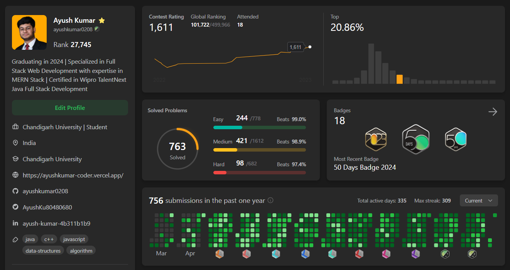
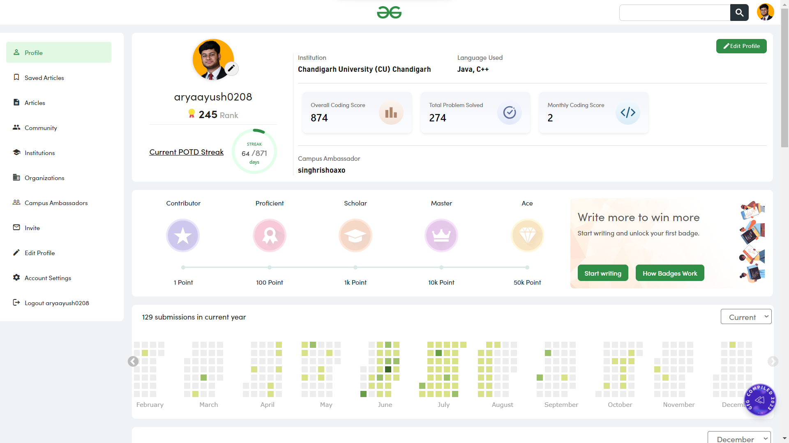

<h3 align="center">Skills</h3>

<h3 align="center">Coding Profiles</h3>

|  |   <h3>LeetCode</h3> 
- Solved 750+ Data Structures and Algorithm Problems.
 
- LeetCode Contest Highest Rating: 1611.
    |
|---------------------------|:------------------------------------------------------------------------------------------------------------------------------------------:|
|       | <h3>GeeksForGeeks</h3> 
- Solved 290+ Data Structures and Algorithm Problems.
 
- Institution Rank 250 @GeeksForGeeks.
 |

<h3 align="center">Links</h3>

Know more about me at <a href="https://ayushkumar-coder.vercel.app/">ayushkumar-coder.vercel.app</a>

<!--
**ayushkumar0208/ayushkumar0208** is a ✨ _special_ ✨ repository because its `README.md` (this file) appears on your GitHub profile.

Here are some ideas to get you started:

- 🔭 I’m currently working on ...
- 🌱 I’m currently learning ...
- 👯 I’m looking to collaborate on ...
- 🤔 I’m looking for help with ...
- 💬 Ask me about ...
- 📫 How to reach me: ...
- 😄 Pronouns: ...
- ⚡ Fun fact: ...
-->
